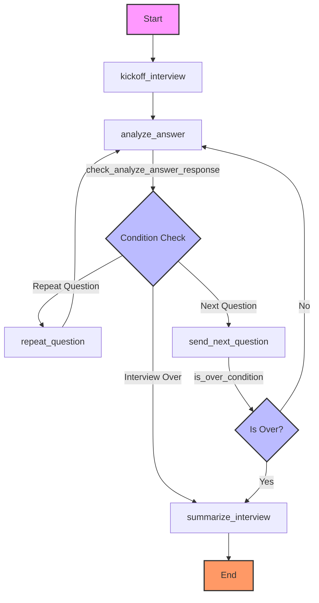

```mermaid
graph TD
        START[Start] --> A[kickoff_interview]
        A --> B[analyze_answer]
        
        B -->|check_analyze_answer_response| C{Condition Check}
        C -->|Repeat Question| D[repeat_question]
        C -->|Next Question| E[send_next_question]
        C -->|Interview Over| F[summarize_interview]
        
        D --> B
        
        E -->|is_over_condition| G{Is Over?}
        G -->|Yes| F
        G -->|No| B
        
        F --> END[End]
        
        style START fill:#f9f,stroke:#333,stroke-width:2px
        style END fill:#f96,stroke:#333,stroke-width:2px
        style C fill:#bbf,stroke:#333,stroke-width:2px
        style G fill:#bbf,stroke:#333,stroke-width:2px
```